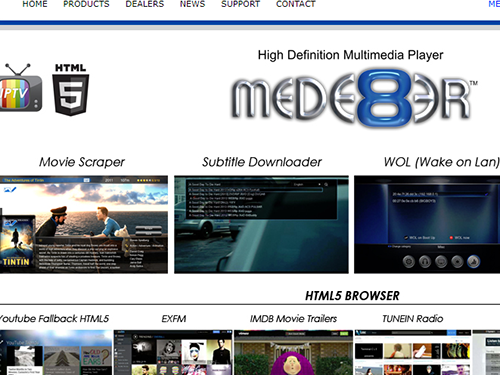
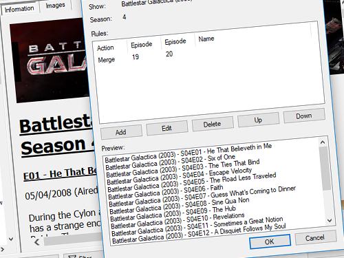
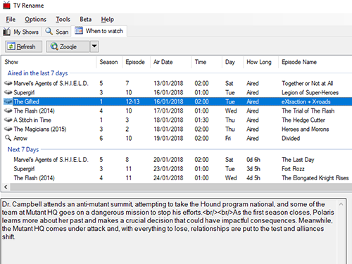
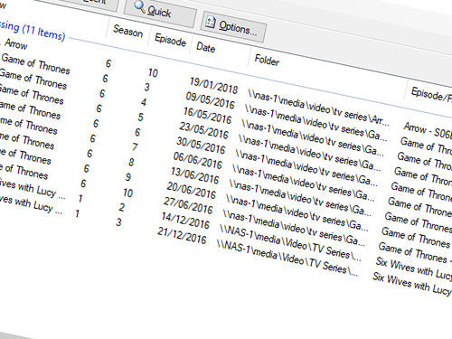
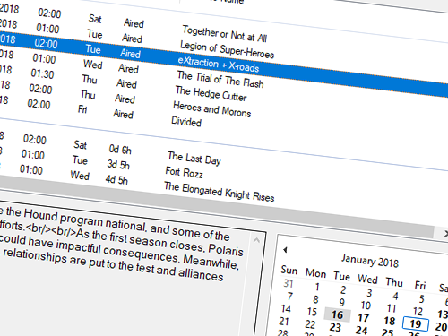
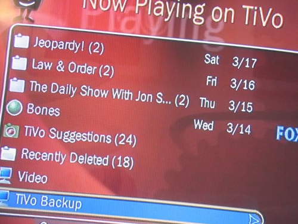
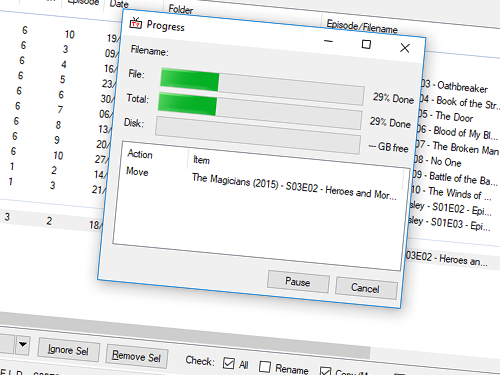
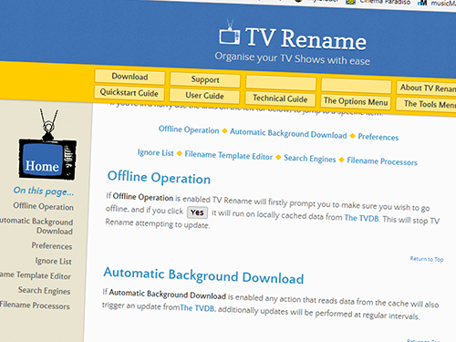
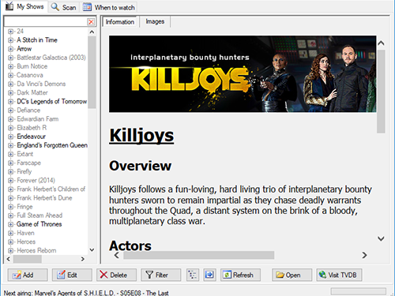
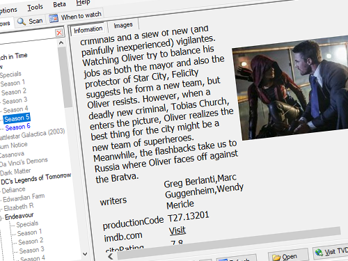

	
	
	
	
	
	
	
	
	
	
	
	
	
	
	
	
	

##### Welcome to 
#### TV&nbsp;Rename
***The tool that helps you organise your TV Show Collection with ease...***

## What is TV Rename?
TV Rename is a media management tool that runs on Windows XP and later, looking after all your TV Show files and making them presentable for Kodi (XBMC), Mede8er, pyTivo and other media hubs.

On the surface TV Rename will "fix" the names of TV Show files...

Say you've got a few TV Show episodes saved as video files, they will probably have names like this: -

> ***Grey's.Anatomy.S03E04.blah-blah.xvid.avi***

But you want them automatically renamed including the show and episode name and the season and episode number like this: -

> ***Grey's Anatomy - S03E04 - What I Am.avi***

...this is the tool for you!

## But wait... There's more!
**TV Rename can: -**
* Rename files, using data from [TheTVDB.com](http://thetvdb.com "Visit TheTVDB.com") and rules you can configure
* Monitor specified folders for TV Show files

> ***"Media Library"*** - *a folder (or folders) somewhere on your PC or NAS or whatever, with a bunch of TV Show files in it (them).*

**Once TV Rename knows about your Media Library it can: -**
* Copy (or move) files from monitored folders to your Media Library
* List any missing TV Show episodes/seasons in your Media Library
* Create web searches to help you find missing TV Show files
* Tell you how long you'll have to wait until the next episode of your current favourite TV Show airs

***Here is a quick summary of the information you'll find lurking inside the menu system above...***

## [Quickstart Guide](quickstart "Read The Quickstart Guide")
The Quickstart Guide will help you through the initial setup of TV Rename creating a working system with your media files.&emsp; *[Read the guide...](quickstart "Read The Quickstart Guide")*

## [User Guide](userguide "Read The User Guide")
The User Guide picks up where the Quickstart Guide finishes, discussing the three main tabs and their use in some detail.&emsp; *[Read the guide...](userguide "Read The User Guide")*

## [Technical Guide](technical "Read the Technical Guide")
***Get the oily rag out, its time to get your hands dirty...*** [Read the Technical Guide](technical "Read the guide").

## [The Options Menu](options "Read about Options and Preferences")
The Options Menu takes you gently through virtually every available option and preference helping you to get TV Rename to behave just the way you want.&emsp; *[Read more...](options "TV Rename's Options and Preferences")* 

## [The Tools Menu](tools Read about TV Rename's Tools")
The Tools Menu discusses some of TV Rename's other features including forcing updates and the like.&emsp; *[Read more...](tools "TV Rename's Tools")* 

## [Command Line Interface](cmd-line "Read about using the CLI")
10 things you can do from the [command line...](cmd-line "Read about using the CLI").

## [Tips and Tricks](tips-tricks "Read Tips 'n' Tricks")
Helpful hints, and inside information (from the developers among others).&emsp; *[Read more...](tips-tricks "Read Tips and Tricks")*

## [Support](support "Read the Support Page")
There are a number of routes to get help with TV Rename, you'll find all the details *[here...](support " Read the Support Page")* 
In addition there is a direct link to the *[TVRename Forum...](https://groups.google.com/forum/#!forum/tvrename "Visit the TV Rename Forum")*.

