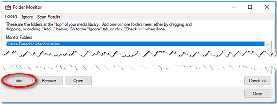
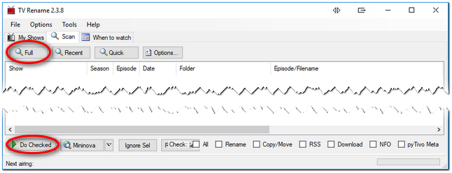

#### Welcome to TV Rename!

This guide will help you through the initial setup TV Rename.

To return to this page click `Quickstart Guide` in TV Rename's **Help**, or browse to [www.tvrename.com/quickstart](quickstart "Browse the TV Rename Quickstart Guide on-line").

> This guide assumes you already have the beginnings of a "Media Library" - *a folder (or folders) somewhere on your PC or NAS or whatever, with a bunch of TV Show files in it (them). TV Rename doesn't care how these folders are organised, however to us mere humans probably "one folder per show" or "one folder per show with one sub-folder per season" would make sense in terms of being able to (manually) find stuff later if you really need to.*

#### Basic Setup

## 1. Add content from your Media Library

1. Follow the menu to **Tools>Folder Monitor** and whilst on the ***Folder*** tab of the newly opened window click `Add`. Browse to the root folder of your "Media Library" and click `OK`. The path will be added to the "Monitor Folders" list.

2. Click the `Check >>` button, the selected path will be scanned and any content with a recognised structure automatically displayed in the ***Scan Results*** tab.

3. In the ***Scan Results*** tab, click `Auto ID All` and TV Rename will attempt to match the found content against [TheTVDB](http://thetvdb.com "Visit TheTVDB.com"), and ascertain if the show is part of a "flat" structure with all the episodes in one folder, or a "tree" structure with sub folders for each season and specials.  
Any shows not identified will not have an entry in the **Show** column or the **thetvdb code** column; these can be fixed manually by highlighting the relevant row in the table and clicking `Edit` and using `Search` to interrogate [TheTVDB](http://thetvdb.com "Visit TheTVDB.com").

4. Once the match process has finished, click `Add & Close` and accept the confirmation, all the identified shows will be added to the ***My Shows*** tab.

5. ***My Shows*** will now be populated with the TV shows that have been identified, however there is currently no "Season" information. click `Refresh` and all the season information will be downloaded (depending on the size of your Media Library this may take a little while).

6. Once the download is complete you can browse the series information. Here, by right clicking on a show or season, you can edit the TV Rename settings to override information fetched from [The TVDB](http://thetvdb.com "Visit TheTVDB.com") .

7. You can manually add shows by clicking the `Add` button in the ***My Shows*** tab. Enter the show name, and click `Search` to find it.
Enter the base folder for the show in your Media Library, and select whether or not you have a sub-folder for each season.

## 2. Set your Preferences
{:.pic-r}
1. In **Options>Preferences**, go to the ***Search Folders*** tab and `Add` the locations you normally use for downloading new episodes. This is where TV Rename will look for new media files.

2. Visit **Options>Filename Template Editor** to set how TV Rename will rename your files.

3. Take a look at the other tabs in **Options>Preferences** to get an idea of the changes that can be made to TV Renames behaviour.

## 3. Run a Scan

1. Go to the ***Scan*** tab, and click `Full`. TV Rename will download any needed show information from [TheTVDB](http://thetvdb.com "Visit TheTVDB.com"), and compare it with the contents of the Media Library. Settings in **Options...** will change the behaviour here.

2. When the scan is complete, review TV Rename's suggested changes and other information. Any ticked item will be actioned, so un-tick things you're not sure about, or use the check boxes in the bottom-right of the screen for a less granular approach. Right-click on selected items for more actions.

3. Click `Do Checked` and TV Rename will process the ticked actions, moving and renaming files as necessary.

## 4. Ongoing Monitoring
1. Go to the ***When to watch*** tab to see all known future information (including air dates) of shows you are following.

2. In the ***Search Folders*** tab of **Options>Preferences** ticking the "Monitor folders for changes" box will tell TV Rename to automatically scan whenever a new file is made available.

## 5. Sit back, relax, and let TV&nbsp;Rename do all the hard work for you!
***Whatever changes TV Rename makes to your recording names the season and episode details will remain untouched.***
*It is highly unlikely that the names of the recordings will get screwed up, but, should it happen, the problem should be easily fixable after changing some settings, or adding new rules. At least, that's the theory.* :sunglasses:
