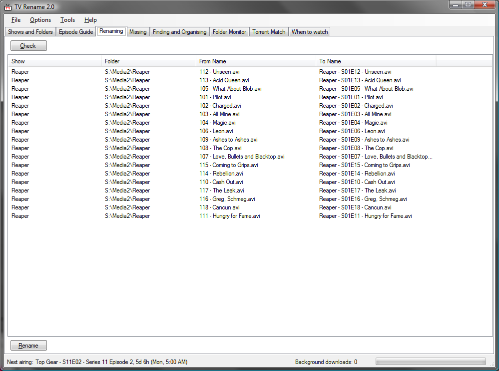

# Screenshots
These are from an older version, but the idea is the same. Here you set up what shows you are interested in, and where they are on your computer:

Read the epsiode guides for your shows:

Rename files to "nice" names, in one of a number of selectable styles:

See if any episodes are missing from your collection:

Search your download directories for missing episodes, and move/copy them to where they should be:

See what is airing when:

Picks up when new folders are added to your library, and makes it easy to add them to your "Shows and Folders" list.

Given a .torrent file, and a directory of files, rename the files in the directory to match the torrent. This works on all file types, not just AVIs. The file just has to be big enough to have a partial hash done on it.

 
