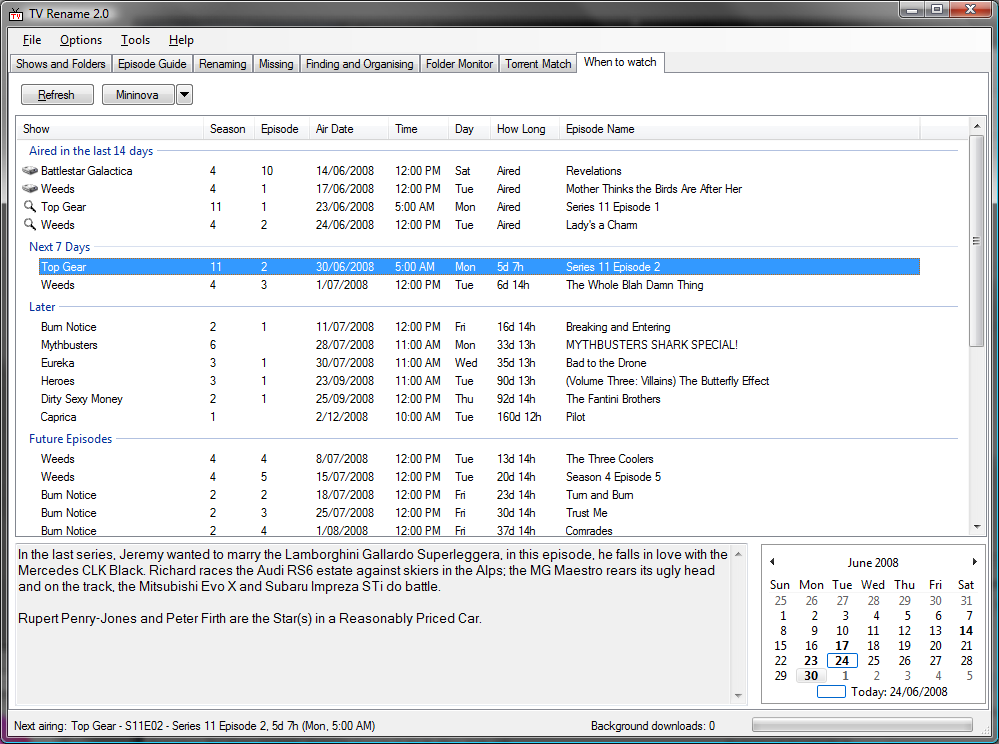
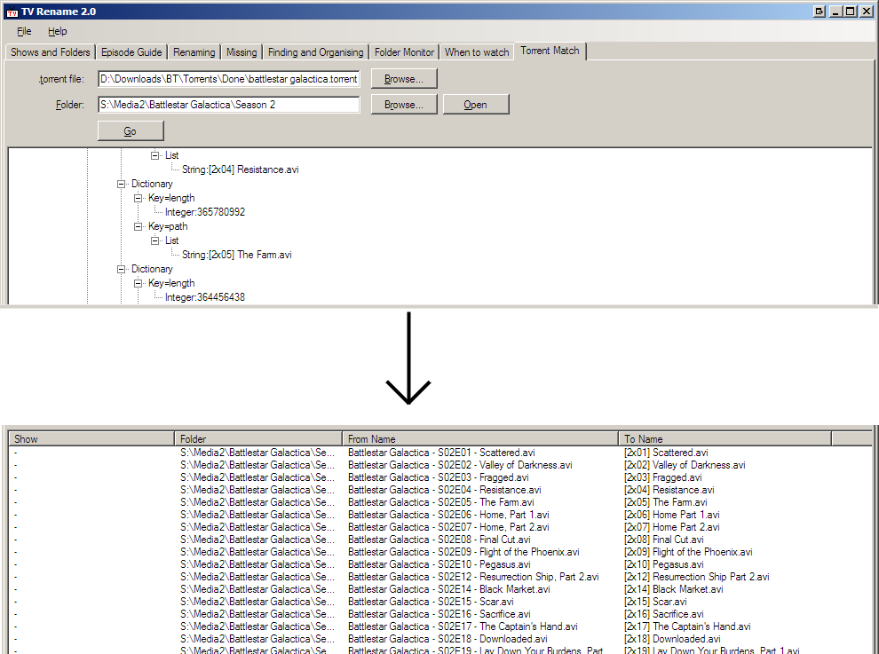

# Screenshots
Here you set up what shows you are interested in, and where they are on your computer:

## Episode Guide
Read the epsiode guides for your shows:

## Identify and Fix any issues 
Search your download directories for missing episodes, and move/copy them to where they should be; rename files to "nice" names, in one of a number of selectable styles; see if any episodes are missing from your collection

## When to Watch
See what is airing when:

## Auto Scan
Picks up when new folders are added to your library, and makes it easy to add them to your "Shows and Folders" list.

## Torrent Matching
Given a .torrent file, and a directory of files, rename the files in the directory to match the torrent. This works on all file types, not just AVIs. The file just has to be big enough to have a partial hash done on it.

 
