# Preferences Dialog

## General

The filename character replacements set what to use if the episode name has a character in it that isn't allowed in a Windows filename.

The "days count as recent" specifies how many days to show for "Aired in the last N days" in the "When to Watch" tab. The "Startup tab" is what TVRename shows when you open it. The "Default Naming Style" is what is used for new folders that you add, so if you are adding a lot, set it here first!

"Use sequential number matching" will match episodes based on their overall airing order. Because this causes a lot of false matches, it is off by default. For example, Seinfeld S08E02 is the 136th episode aired, so with this option "Seinfeld - 136 - The Soul Mate.avi" will be seen at S08E02.

"Find Extensions" sets the extensions of media files to look for. Separate them each with a semicolon, don't use spaces, and make sure you put the dot in!

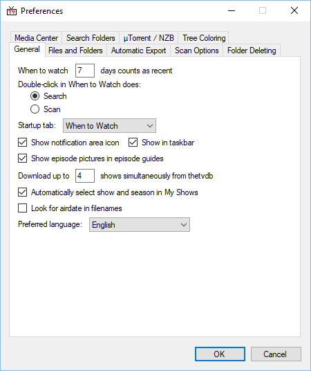
## Files & Folders
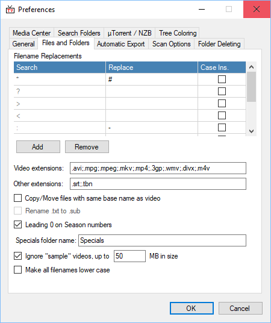
## Automatic Export
"RSS Export" will save a RSS-reader compatible XML file to the location you specify. It can then be read by something like XBOX Media Center, or the Vista RSS Widget. You can limit how many days or shows are written to the file. The RSS file is updated whenever the "When to watch" tab is manually or automatically refreshed.

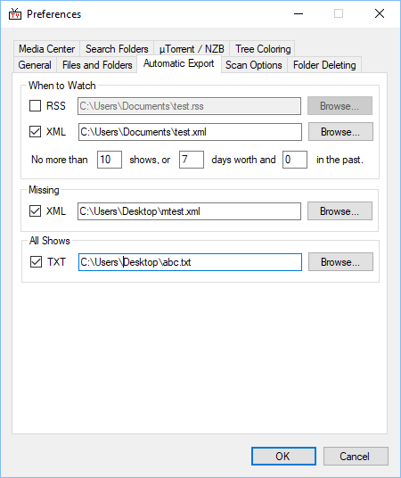
## Scan Options
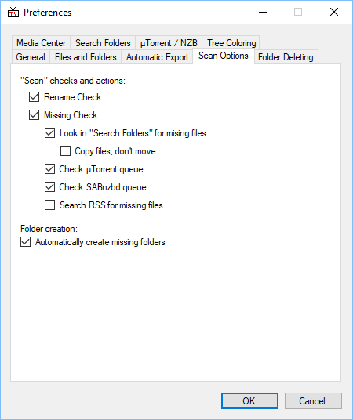
## Folder Deleting
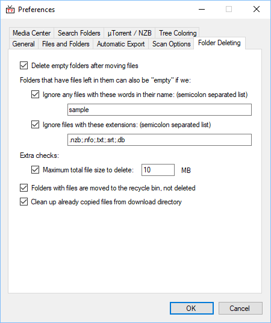
## Media Centre
This is were you configure the type of media player (and hence what additional files you need TV Rename to download)
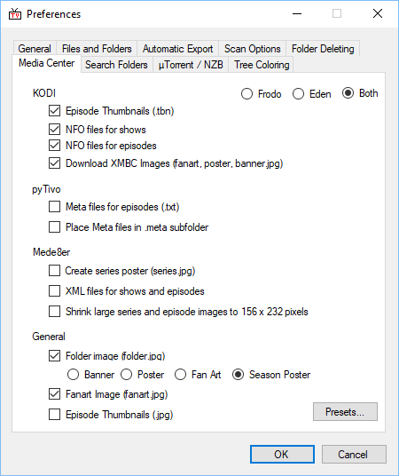
## Search Folders
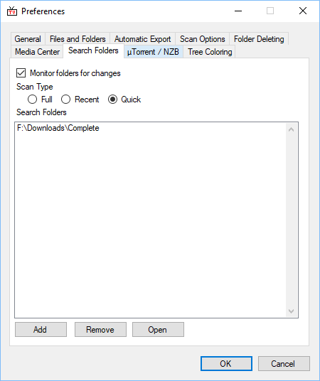
## uTorrent / NZB
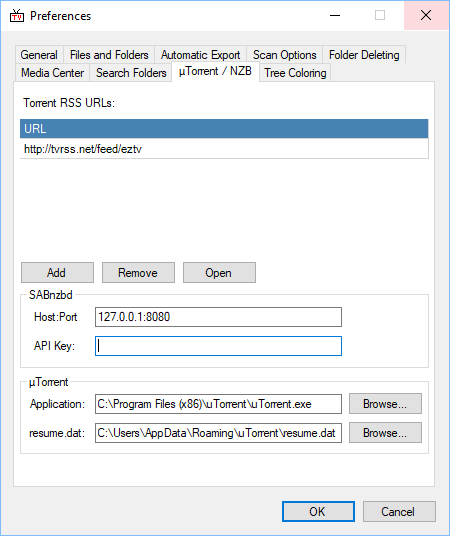
## Colouring
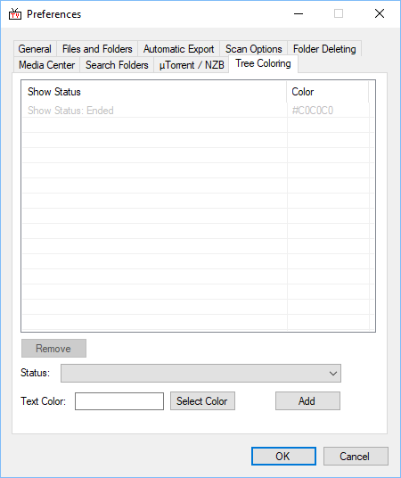

# Other Settings
## File Name Processors
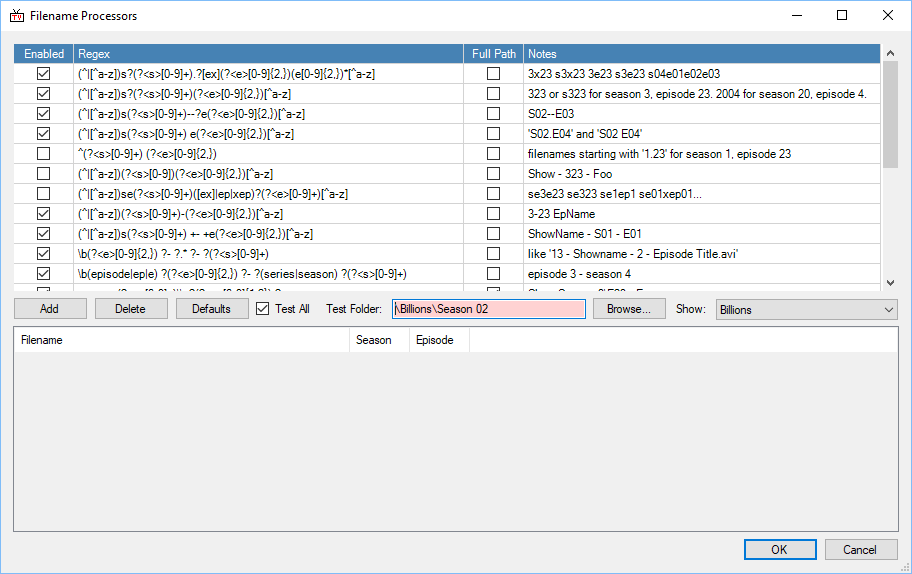
## Search Engines
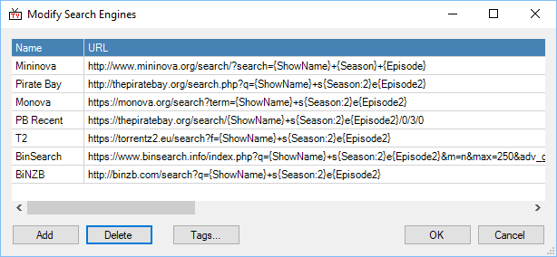
## Template Editor
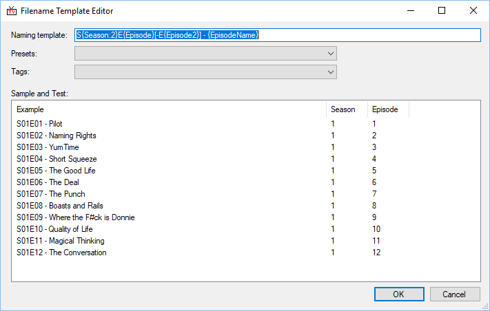
