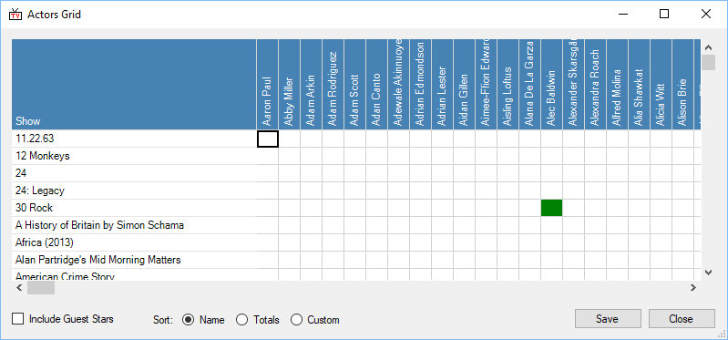

## Folder Monitor
This is admittedly probably the most confusing, non-obvious, but most useful window there is. :)

This will monitor your media collection for new shows (folders), that TVRename hasn't seen before, and help you to quickly add them to the "My Shows" tab.

Before using this, make sure your preferred renaming style is set in the preferences dialog.

Add (or drag+drop) folders to the "monitor folders" list in the top left. Click the Check button, and TVRename will recursively search for new folders. The middle list will then be filled. Using its existing cache of tvdb.com codes, it will automatically guess and fill in the season number and code for each folder.

Click on a show to edit it. You can then type a tvdb.com code, or part of a show name, to find the tvdb.com code in the list. If it isn't showing up, type in part of the name and press the Search button. This searches on tvdb.com, and will add any results to the local code cache.

After entering the code, or clicking on the show in the list, enter (or correct) the season number. Changes are immediately applied to the "New shows and folders" list. If you select multiple folders, all will be updated simultaneously.

**Visit tvdb.com** will take you to the tvdb.com page, so you can check it is the right show. Guess will re-guess the show details.

Clicking Remove, or pressing delete on your keyboard will remove the selected folder(s) from the list. It will be re-detected the next tiem you do a Check here. Click Ignore to add the folder to the "Ignored Folders" list. Ignore All will ignore all folders in the list.

Open will open an Explorer window in that folder. Clicking on Done will then take all the shows with tvdb.com codes and season numbers, and add/merge them into your shows and folders lists.

In the example here, if the user clicked "Done" then only Seinfeld would be added. The other two shows are missing either the season number, or tvdb.com code.

## Exporters
"RSS Export" will save a RSS-reader compatible XML file to the location you specify. It can then be read by something like XBOX Media Center, or the Vista RSS Widget. You can limit how many days or shows are written to the file. The RSS file is updated whenever the "When to watch" tab is manually or automatically refreshed.

Below is an example of the RSS output being displayed in a Vista sidebar gadget. Clicking on each item shows the episode summary information.

## Actors Grid

## Buy Me A Drink!
I'm a thirsty man, so I need lots of drinks. :)

## Statistics
Just how useful has TVRename been? "Episodes on disk" is the number of episodes found the last time a "missing check" was done. "Total Episodes" is the count from the tv.com episode guide for all the shows you have.

## Torrent Match
The "Torrent Match" tab lets you rename files, so their names match what is in a .torrent file. This is done using the torrent hashes, so it will work on any type of file, as long as it is big enough for a partial hash to be done on it.

Choose the .torrent file, and folder of files to rename. If you choose a "Copy To" location, the files will be copied to their new names, leaving the originals intact. If it is off, then they will be renamed in place. 

Currently, TVRename can only process single file torrents, and multi-file torrents without subdirectories in them.

After clicking "Go", the torrent file will be processed. This can take a while if the torrent file has a lot of items in it, or there are a lot of potential matches in the "Folder" you have selected.

If processing is successful, you will be taken to the rename or finding and orgnising tab, to see the suggested operations. Your files will only be modified if you click "Rename" or "Move/Copy" from there.

It's not possible to rename the files in (a multiple file) torrent, to match what you have on disk. Changing the names affects the hash, which makes it a different torrent from the tracker's point of view. Because of this, TVRename renames the files on disk instead.
