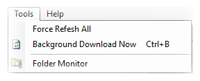
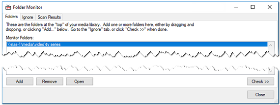
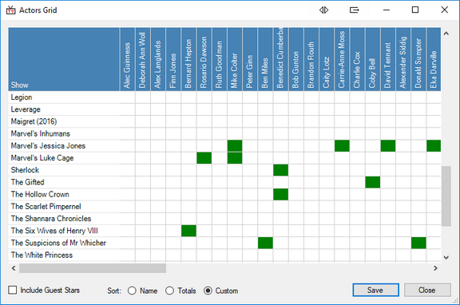

#### Tools
{:.pic-r}
Here you can find tools to update, manipulate and annihilate the data relating to your Media Library and TheTVDB cache.

Sort out once-and-for-all which of your favourite actors are in which shows and vice-versa.

You can also do some clever stuff manipulating and re-creating torrent files.

{:.clear}
## Force Refresh All
{:.pic-l}
If TV Rename's representation of your Media Library is a mess then this is probably the Tool for you.

After selecting the option from the menu you are presented with the alert window (shown).

{:.clear}
**READ IT CAREFULLY AND PAY ATTENTION**. If you click `Yes` there's no going back, all the locally stored information in TheTVDB's cache will be **DELETED**.

{:.toplink}
[Return to Top]()

## Background Download Now
*Background Download Now* forces an update from TheTVDB to be downloaded. If *Options>Offline Operation* is enabled you will be asked if you wish to "Ignore offline mode and download anyway" (Yes/No), if you select `Yes` the update will start.

{:.toplink}
[Return to Top]()

## Folder Monitor
 
From here you can check your Media Library for new show folders unknown to TV Rename and quickly add them to the ***My Shows*** tab.

Before using this tool, check that your preferred renaming style is set in [*Options>Filename Template Editor*](options#filename-template-editor "Visit Options>Filename Template Editor").

`Add` (or Drag-and-Drop) folders to the ***Folders:*** tab. Click the `Check >>` button, and TV Rename will recursively search through the new folders looking for new tv shows. Once this is complete and if anything is found, the ***Scan Results*** tab will appear, populated with the paths to any newly found shows, it will also identify the folder structure of the show ("Flat" - everything in one folder or "Folder per season").

Click the `Auto ID All` button and TV Rename will try and identify the newly found shows using cached data from TheTVDB. If the show is found the "Show" and "thetvdb code" columns will be populated. If a show isn't being matched or is incorrectly identified highlight the row in question and use the `Edit` button to perform a manual search of [TheTVDB.com](http://thetvdb.com "Visit TheTVDB.com"), and for a more in-depth interrogation you can use the `Visit TVDB` button which will launch a web browser targeting the shows page or `Open Folder` which will open the selected folder in Windows Explorer.

Clicking `Remove` will remove the highlighted row from the New Shows list, however it will be re-detected in the next run of "Auto ID All".

Clicking `Ignore` will add the folder to the "Ignore Folders:" list and it will be ignored is subsequent scans.

## Actors Grid
Really like that actor in "Such-and-such"? Sure they are in other shows in your Media Library? This is the tool to tell you!

Among the metadata that [The TVDB](http://thetvdb.com "Visit thetvdb.com") collects (and you import) is information about actors, they may be a shows "core characters" or "guest stars" but the data is available for every episode of every season of every show on TheTVDB (If it's not or you know better please visit [their site](http://thetvdb.com "Visit thetvdb.com"), log in and fix it - it's to everyone's benefit.

Think of a spreadsheet, with actors names along the top (and a total at the end) and show names down the side (and a total at the bottom), now make it totally dynamic and fill the matching actor/show cells in green...

The data can be manipulated further: along the bottom of the window are an "Include Guest Stars" tick box, "Sort:" radio buttons and `Save` and `Close` buttons.

Ticking the "Include Guest Stars" box will expand the grid further to include  guest stars of the shows (in light green).  Sorting on "Name" will re-arrange the data alphabetically by actor name **and** by show name.  
Clicking on "Totals" will place the show with the most actors at the top of the list and the actor in the most shows to the left of the list.  
Custom is automatically selected if you click on an actors or shows name.  
If you click on an actors name they will be moved to the left of the grid with all the shows they appear in at the top.  
Similarly, clicking on a show name will move it to the top of the grid with all the actors that appear in it moved to the left.

Clicking `Save` will save the entire grid as a "Portable Network Graphic" (.png) file to a path of your choosing.

The Actors Grid has one more (undocumented) trick up its sleeve. If you click on one of the green cells your web browser will launch targeting the actor whose column the green cell is in at the "Internet Move Database" [IMDb.com](http://www.imdb.com "Visit IMDb").

## Torrent Match

The "Torrent Match" tab lets you rename files, so their names match what is in a .torrent file. This is done using the torrent hashes, so it will work on any type of file, as long as it is big enough for a partial hash to be done on it.

Choose the .torrent file, and folder of files to rename. If you choose a "Copy To" location, the files will be copied to their new names, leaving the originals intact. If it is off, then they will be renamed in place. 

Currently, TVRename can only process single file torrents, and multi-file torrents without subfolders in them.

After clicking "Go", the torrent file will be processed. This can take a while if the torrent file has a lot of items in it, or there are a lot of potential matches in the "Folder" you have selected.

If processing is successful, you will be taken to the rename or finding and orgnising tab, to see the suggested operations. Your files will only be modified if you click "Rename" or "Move/Copy" from there.

It's not possible to rename the files in (a multiple file) torrent, to match what you have on disk. Changing the names affects the hash, which makes it a different torrent from the tracker's point of view. Because of this, TVRename renames the files on disk instead.

## µTorrent Save To

