#### User Guide
If you're new to TV Rename you should read the [Quickstart Guide](quickstart "Read the Quickstart Guide") first (it's only a 3-4 minute read and will get you up-and-running quickly).

Need help? Please sign up to the [forum](https://groups.google.com/forum/#!forum/tvrename "Visit the TVRename forum"), someone there will be happy to answer any questions you may have.

### Lets (not) start at the beginning...
In true technical manual fashion we're going to start at the end because, as is so often the case, it makes sense to see where your going to help figure out how to get there.

## When to watch
Once you have TV Rename up and running and behaving the way you want you'll probably spend most of your time here. If you wish you can make this tab open by default by changing the Startup tab setting in the ***[General](options#general)*** tab of **Options>Preferences**.

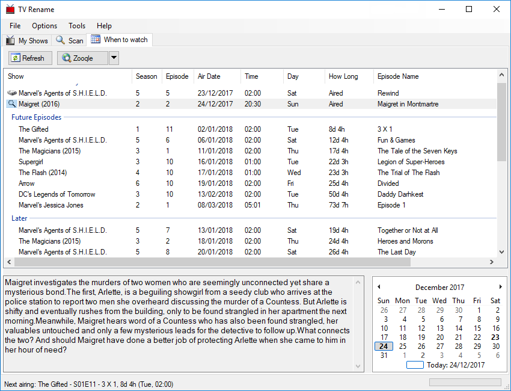
Looking at the list in the main panel we see details of recent and future show episodes matching the TV Shows found in the Media Library.

At the top of the panel episodes "Aired in the last 7 days" are shown (you can actually modify the number of days in the ***[General](options#general)*** tab of **Options>Preferences** if you wish).

In this example there are two shows listed. The disk icon to the left of "Marvel's Agents of S.H.I.E.L.D." indicates that the episode was found in the Media Library and the magnifying glass to the left of "Maigret (2016)" indicates that the episode cannot be found locally. Double clicking on this row will launch your default web browser (pointing to a page of your choice - in this case Zooqle) pre-loaded with search parameters to look for the missing file (configured in **[Options>Search Engines](options#search-engines)**).

The next section tells us what shows found in the Media Library will be airing new episodes in the "Next 7 Days".

"Future Episodes" looks further ahead and lists the first new episode of each show found in the Media Library not already listed in "Next 7 Days".

"Later" shows the rest of the future episode information matching shows in the Media Library that [TheTVDB](http://thetvdb.com "Visit thetvdb.com") knows about.

The next two panels show (on the left) a summary for the episode highlighted in the main panel and (on the right) a calendar indicating the dates episodes were/will be broadcast (in bold type). The calendar interacts with the main panel. Clicking on a bold date will highlight the episode matching the date in the list above, and clicking on an episode in the main panel will cause the calendar to display that date. In either case the episode summary will be updated (if there is one).

**As stated elsewhere; the content presented by TV Rename is only as good as that found at [TheTVDB](http://thetvdb.com "Visit thetvdb.com") so please consider registering and helping to maintain their content - everybody benefits!**

*In keeping with our jumping-about policy lets look at My Shows next.*

{:.toplink}
[Return to Top]()

## My Shows
My Shows displays a list of TV shows found and Identified in your Media Library, and is where you can manually tell TV Rename about a new TV Show in the library, where it can be found and how it is structured.

In essence this tab (along with some of the [preferences](options#preferences)) allows you to configure the interaction between [TheTVDB.com](http://thetvdb.com "Visit thetvdb.com") and your Media Library. Incidentally there can be multiple storage locations including local paths or drives on your computer, mapped network shares and UNC paths. The only restrictions being that a TV Show cannot be spread across multiple locations, and removable USB drives should be set up so they are always assigned the same path or drive letter each time they are connected. 

Here, you can see a number of shows listed in the left hand panel of the window. These are the shows that TV Rename is monitoring, if a show is in your Media Library it will have further information associated with it (its "home" folder in the Media Library for example, but there is much more). In the right hand panel you can read details about the highlighted show gleaned from [TheTVDB.com](http://thetvdb.com "Visit thetvdb.com").

There is a small "search filter" at the top of the Show List panel, typing in this box here will allow you to hide the display of shows that don't match the text.

The right hand panel has two tabs, "Information" and "Images", the usual setting is "Information", however selecting "Images" displays all the cached images for a show or season of a show collected from [The TVDB](http://thetvdb.com "Visit thetvdb.com"). Control of just what images are acquired is managed using the ***[Media Centre](options#media-center)*** tab of *Options>Preferences*. 

Below these panels are a series of buttons which allow you to manage the content. They are: -

* {:.no-icon} `Add` - Adds a new show to the list. Remember you may need to add folders to for the show separately if you need to monitor it in the Media Library. You don't need to add a folder if you only want to see the shows air-dates in the ***[When to Watch](#when-to-watch "go to "When to Watch")*** tab.

* {:.no-icon} `Edit` - Edit the currently selected show or season.

* {:.no-icon} `Delete` - Remove the currently selected show(s).

* {:.no-icon} `Filter` - Filter the listed shows based on the entered criteria.

* {:.no-icon} `Expand` - Toggle between a collapsed view of the Show List (just the show names) and an expanded view (show names, seasons and specials).

* {:.no-icon} `Information` - Toggle between showing and hiding the (right hand) Information Panel. If the panel is hidden the Show List panel expands to fill the tab.

* {:.no-icon} `Open` - Opens the folder for the highlighted show or season in explorer.

* {:.no-icon} `Visit TVDB` - Visit TheTVDB page for highlighted show or season.

{:.pic-l}
Clicking on the `Add` button will open the *Add/Edit Show* window ready to add another show. 

Clicking the `Edit` button with a **show** highlighted will open the same window pre-populated with that shows details. 

Clicking `Edit` with the **season** of a show highlighted will open the *Edit Season Rules* window - *[more on this later](#edit-season-rules "Read about Edit Season Rules)...*

{:.clear}
{:.toplink}
[Return to Top]()

## Add/Edit Show

As you can see the *Add/Edit Show* pane has a number of tabs of its own:

{:.center}
[Basics](#the-basics-tab)&nbsp;&#9670;&nbsp;[Advanced](#the-advanced-tab)&nbsp;&#9670;&nbsp;[Show Aliases](#the-show-aliases-tab)&nbsp;&#9670;&nbsp;[Search](#the-search-tab)

We'll start by completing the ***Basics*** tab (illustrated above).

### The Basics Tab
In the following example, we'll add a new show called "The Good Doctor" to TV Rename.

{:.pic-r}
The first step is to tell TV Rename about the show. If you know it you can enter TheTVDB's code for the show, otherwise type the shows name (e.g. "the good doctor") and click on `Search`. TV Rename will search for matches to your entry in TheTVDB's database, cache the results locally and display the matches. The search also works with partial show names. For example you could search for just "doctor", but "doctor" being fairly common in TV Show titles, returns over 80 results (including ours!), and you will have to delve into the list to find the one you want. Once you have found the correct show, click on it to highlight it.

If all you want to do is see the details of the show then you're done! Just click `OK` at the bottom of the window and TV Rename will pull the necessary data from [The TVDB](http://thetvdb.com "Visit thetvdb.com") to populate the ***My Shows*** tab.

Once the update is complete ***My Shows*** includes "The Good Doctor" and looks like this: -
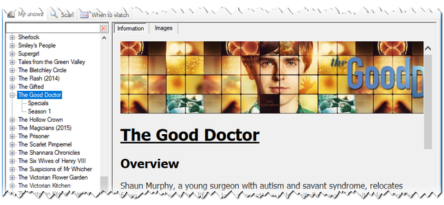
All the Show and Season information is downloaded and the ***When to Watch*** tab will now list any future episode dates, but there are no links to the Media Library.

Lets go back and tweak "The Good Doctor" to include it in the library. Assuming the show is listed in ***My Shows***, make sure it is highlighted and click `Edit` to recall the partially populated *Add/Edit Show*. If it isn't listed in ***My Shows*** follow the steps above to get the show name populated and then carry on as described below. 

The "Custom show name:" field allows you to change the shows name in both TV Rename and the Media Library (except the base folder). You may like to remove "The" from names, or change extra information like the year the show was originally produced that appears with some shows. If you tick the box and enter a new name in the field provided the shows title will be replaced with this entry.

The "Airs in Timezone:" drop-down tells TV Rename that the air time from [The TVDB](http://thetvdb.com "Visit thetvdb.com") is in that specific timezone. Most shows are in Eastern USA time, but British shows (e.g. Maigret) will be in British Standard Time. This only has an effect in the "When to Watch" tab which translates these times into your local timezone, or in the status bar when calculating time till the "Next Airing:".

*Default:* ***Eastern Standard Time***

If you wish to ignore specific seasons of a show enter the season numbers (space separated) in the "Ignore Seasons:" field (Entering a "0" will ignore "Specials").

*Default:* ***Empty Field***

Ticking "Automatic Folders:" will tell TV Rename to automatically create folders as needed within the Base Folder.

*Default:* ***Ticked***

Completing "Base Folder:" starts the magic! The path to the base folder for "The Good Doctor" can be typed in the text box or filled in by browsing, but either way, now TV Rename knows about the location of the shows base folder in the Media Library all the "really useful" stuff can begin!

The "Folder per season" tick box and "base name:" text box go together. If the tick box is un-ticked TV Rename will assume that all the files related to "The Good Doctor" reside in the base folder, if the box is ticked and a name is provided then TV Rename assumes there are sub folders for each season and will create them if "Automatic Folders: is ticked.

| *Defaults:* | "Folder per season" | ***Ticked*** |
| | "Base name:" | ***"Season"*** |

The final entry in this tab is the "Pad season number to two digits" tick box. un-ticked (with the default base name) the season would be: -

Season 1, Season 2, Season 3, Season 4 etc.

If the box is ticked: -

Season 01, Season 02, Season 03, Season 04 etc.

would be used instead.

*Default:* ***Un-ticked***

Don't forget to click `OK` when you're done.

***These settings are the minimum required by TV Rename to manage your Media Library,***

However TV Rename's middle name is "configurability", so lets take a look at the other *Add/Edit Show* tabs.

{:.toplink}
[Return to Add/Edit Show](#addedit-show)&nbsp;&#9670;&nbsp;[Return to Top]()

### The Advanced Tab
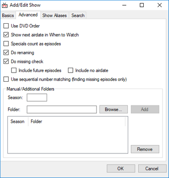{:.pic-l}
Here, you can further manipulate the way data from [The TVDB](http://thetvdb.com "Visit thetvdb.com") is handled as it is merged into the local data.

The "Use DVD order" tick box comes into play when the episodes aired on TV in a different order to those presented on the DVD. [The TVDB](http://thetvdb.com "Visit thetvdb.com") usually has details of these orders and this tick box allows you to choose your preference for the current show. 
A Really good example of this is the 1967 ITV Show ["The Prisoner"](https://www.thetvdb.com/?tab=season&seriesid=74805&seasonid=8058&lid=7 "Visit \"The Prisoner\" on TheTVDB"), which, whilst it was written as one season of seventeen episodes still causes as much controversy (and argument) over it's running order today as it did when it was originally released.

The "Show next airdate in When to Watch" tick box toggles the display of the shows "Future" and "Later" episodes in the ***When to Watch*** tab.

The "Specials count as episodes" tick box is useful with shows such as "Mythbusters" where specials are often counted as normal episodes.

The "Do Renaming" tick box tells TV Rename to use the names built using the [(Options>)Filename Template Editor](options#filename-template-editor) when copying or moving files if it is ticked, otherwise they will be left unchanged.

"Use sequential number matching" will match episodes based on their overall airing order. Because this can cause a large number of false matches, the box is un-ticked by default. 
For example, Season 4 Episode 9 of Marvel's Agents of S.H.I.E.L.D. is the 75th episode aired, so with this option enabled "Marvel's Agents of S.H.I.E.L.D. - 75 - Broken Promises.mkv" will be seen at S04E09.

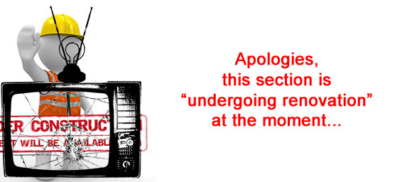

{:.toplink}
[Return to Add/Edit Show](#addedit-show)&nbsp;&#9670;&nbsp;[Return to Top]()

### The Show Aliases Tab
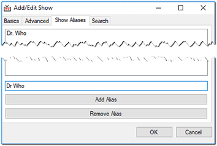{:.pic-l}
The Show Aliases tab only affects source files, it does **not** affect show episodes in your media library (TV Rename can work out the correct name for a file in the library from the containing folder structure and the show/season number).

Sources often rename files because of the excessive length of the shows name, for example "Law and Order- Special Victims Unit" could be represented as "L&O-SVU". Adding "L&O-SVU" as an alias would cause any source file with that abbreviated name be renamed correctly when moved or copied into the library.

Another good example (though for different reasons) would be the BBC1 show "Doctor Who", [The TVDB](http://thetvdb.com "Visit thetvdb.com") correctly calls it "Doctor Who" which TV Rename will recognise, however some sources variously call the show "Dr. Who" or "Dr Who" causing some confusion. 
Adding "Dr. Who" and "Dr Who" as aliases for "Doctor Who" will fix this problem and everything will be correctly named "Doctor Who" when moved or copied into the library.

{:.toplink}
[Return to Add/Edit Show](#addedit-show)&nbsp;&#9670;&nbsp;[Return to Top]()

### The Search Tab

{:.toplink}
[Return to Add/Edit Show](#addedit-show)&nbsp;&#9670;&nbsp;[Return to Top]()

## Edit Season Rules

The "Edit Season Rules" pane allows you to manipulate the local data from [The TVDB](http://thetvdb.com "Visit thetvdb.com") to suit your episode structure.

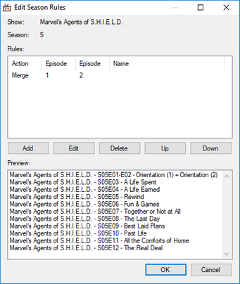{:.pic-l}

Episodes 1 and 2 of Season 5 of "Marvel's Agents of S.H.I.E.L.D." aired as a double episode so only one file exists, however [The TVDB](http://thetvdb.com "Visit thetvdb.com") correctly has both episodes listed individually, so there is a conflict.

The image illustrates a rule that merges the two episodes into one. This will affect the name displayed in the ***My Shows*** tab, and the naming of the file in the Media Library.

The rules are applied in top to bottom order, you can use the the `Up` and `Down` buttons to move a rule.

`Add`, `Edit`, and `Delete` will manipulate the list as expected.

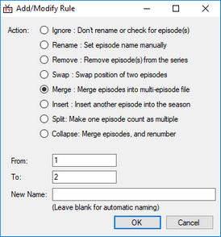{:.pic-r}
Clicking either `Add` or `Edit` will open the *Add/Modify Rule* pane. The only difference being `Add` allows you to create a new rule and `Edit` pulls in the data from a highlighted rule for you to change.

In this example we are editing the rule shown above. This is a two part process, firstly select an "Action:", and secondly tell TV Rename what to apply the action to.

In this case the "Action" is "Merge", we are merging "1" and "2" i.e. Episodes 1 and 2 of the selected season, And we will let TV Rename name the new file automatically.

The "Actions:" available are: -

| **Ignore** | Keep the specified episode in the guide, but don't check for it (or rename it) on disk locally. |
| **Rename** | Manually set the name of an episode. | 
| **Remove** | Make a an episode disappear. All episodes above will be renumbered down to fill the gap. |
| **Swap** | Swap the position of two episodes. |
| **Merge** | The episodes numbers supplied all in a single multi-episode file. |
| **Insert** | Manually add an episode into the season. Later episodes are renumbered to accommodate the change. |
| **Split** | Turn one episode into many. Following episodes are renumbered to accommodate the change. |

After applying a rule, go to ***My Shows***, select the show, and click `Refresh`. You will then see (and can check) the effects of the rules you've created.

{:.toplink}
[Return to Top]()

## Scan
TV Rename can scan your Media Library looking for missing or outdated files and will try to repair any issues it finds automatically. 

There are three types of scan available : -

| **Full** | A full scan of all shows and seasons. |
| **Recent** | A Scan of all the shows that have aired recently. |
| **Quick** | Scan the shows that have aired recently and have a missing episode in the library. Also check the locations specified in *Options>Preferences>Search Folders* for any matching media files.

As with other tabs, "recent" is taken as being the number of days counted as recent indicated in the [Options>Preferences General](options#general) tab. 

***Scan*** indicates where there are gaps in your library. The result of a typical scan is shown below.

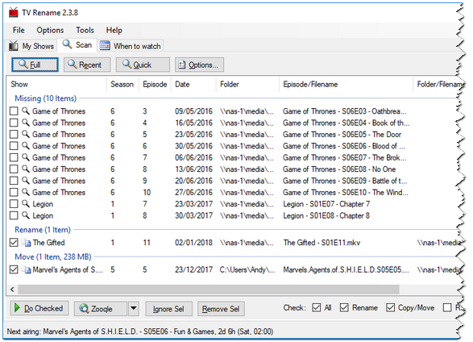

The scan indicates that there a number of missing episodes, a file in the Media Library that needs to be renamed and a file that has been downloaded and is waiting to be moved to the Media Library and be renamed in the process.

Looking at the missing episodes first; even here TV Rename is "trying to help". Note that each entry has a magnifying glass icon to the left of the row. Single clicking one of these rows and then clicking the`Web Search` button (in this case "Zooqle") will launch a search for the indicated file (configured in *[Options>Search Engines](options#search-engines "See Options>Search Engines for details")*). Double clicking one of these rows will launch the same web search. You an also select multiple rows and then click the `Web Search` button to launch a browser with multiple tabs, one for each highlighted row.

If you're having trouble finding what you're searching for you can change the search engine to another in the *[Options>Search Engines](options#search-engines "See Options>Search Engines for details")* list by clicking the `▼` button next to "Web Search" and selecting a different entry.

In addition to the files to be searched for, the ***Scan*** tab is also showing that there is one file to be renamed and one file to be copied or moved (see the [Options>Preferences Scan Options](options#scan-options "See Options>Preferences Scan Options for details") tab). Note both items have a tick in the box icon to the left of each row.

When the `Do Checked` button is clicked everything ticked will be processed.

Note that there are some tick boxes to the right of the buttons. These give you course control over the ticked items, it this case we can toggle everything to be moved and/or everything to be renamed on and off.

In addition you can toggle individual items on or off by clicking directly on their tick boxes.

Once you are happy with everything selected click on `Do Checked` and the Copy/Move/Rename process will start.

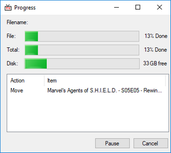{:.pic-r}
While files are being copied and/or moved, this dialog is shown. Click `Pause` to temporarily pause the copy/move operation. Click it again to resume. Clicking `Cancel` will stop the operation immediately. The disk space shown is for the drive that the current file is being copied/moved to.

Selecting rows in the main scan panel and clicking `Ignore Selected` will remove them from the system (permanently unless they are removed from the ignore list - see [Options>Ignore List](options#ignore-list)).

Selecting rows in the main scan panel and clicking `Remove Selected` will temporarily remove them from the scan tab. They will re-appear when the scan is re-run.

{:.toplink}
[Return to Top]()

## The Status Bar
The Status Bar hides at the very bottom of the main window, quietly displaying the next show/episode airing and how long you've got to wait before you can watch it, and the "Background download:" status which is either "Idle" or details of what it's doing!

{:.toplink}
[Return to Top]()

## Repairing Corrupt Data
Occasionally information for shows gets corrupted and needs refreshing. The quickest way to do this is a "Forced Refresh", which comes in two flavours.

Firstly, if the problem is small, only effecting a small number of shows, right clicking a problematic show on the ***My Shows*** tab will pop up a menu on which one of the options is "Force&nbsp;Refresh". Clicking this option will tell TV Rename to go to [The TVDB](http://thetvdb.com "Visit thetvdb.com") and re-collect all the data available for that show and re-populate the local cache. This will often fix the issue.

The second solution is far more drastic in its effect.

"Force Refresh All" in the **Tools** menu is the "Tool of Last Resort". If TV Rename's representation of your Media Library is a real mess or the previous solution doesn't help then this is your only real alternative.

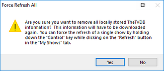{:.pic-r}
After selecting the option from the menu you are presented with the alert window (shown).

**READ IT CAREFULLY AND PAY ATTENTION**. If you click `Yes` there's no going back, all the locally stored information in TheTVDB's cache will be **DELETED**.

The ***My Shows*** tab reverts to showing The TVDB codes instead of show names, indicating that the relevant data has been deleted. Whilst still on the ***My Shows*** tab click the `Refresh` button and the show data will be downloaded again. (Now might be a good time for a coffee, if your library is large and internet connection slow it may take a while!)

Once the download is complete all your shows will re-appear by name.

{:.toplink}
[Return to Top]()

## Help - Statistics
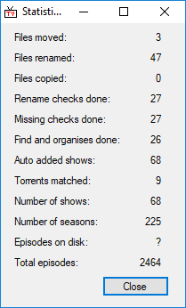{:.pic-l}
Aside from the usual instructions the "Help" menu is hiding one really useful function - **Statistics**.

This statistics illustration (left) was created just two weeks after a fresh install of TV Rename was carried out (so work on updating the documentation could begin with a clean setup).

It's surprising just how much work TV Rename does "managing some videos".

{:.clear}
{:.toplink}
[Return to Top]()
