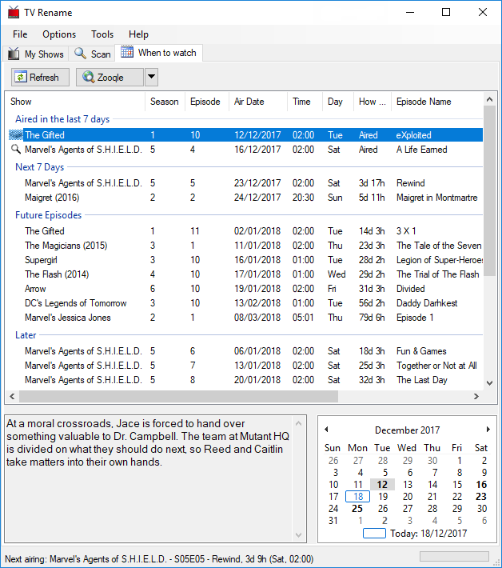

#### User Guide
## Introduction
As I write this guide Version 2.24 of TV Rename is out-in-the-wild and Version 2.3 is in beta making it "quite interesting" trying to keep stuff up to date. We'll do our best but any suggestions for improvements, or offers of help are more than welcome.

**Note:** Comparing the live and beta versions most of the features are the same, or similar. The most recent changes have been regarding enterng show information (***Shows and Folders***), and using [theTVDB.com](http://thetvdb.com "Visit theTVDB.com") as the reference database rather than tv.com.

If you're new to TV Rename you're should probably read the [Quickstart Guide](quickstart "Read the Quickstart Guide") first (it's only a 3-4 minute read and will help you get up and running).

If you need help, please sign up to the [forum](https://groups.google.com/forum/#!forum/tvrename "Visit the TVRename forum"), someone there will be happy to help.

### Lets (not) start at the beginning...
In true technical manual fashion we're going to start at the end because, as is so often the case, it makes sense to see where your going to help figure out how to get there.

## "When to watch"
Once you have TV Rename up and running and behaving the way you want you'll probably spend most of your time here. If you wish you can make this tab open by default by changing the Startup tab setting in the ***General*** tab of **Options>Preferences**.

Looking at the list in the main panel we see details of recent and future show episodes matching TV Shows found in the Media Library.

At the top of the panel episodes "Aired in the last 7 days" are shown (you can actually modify the number of days in the ***General*** tab of **Options>Preferences** if you wish).

In this example there are two shows listed. The disk icon to the left of "Marvel's Agents of S.H.I.E.L.D." indicates that the episode was found in the Media Library and the magnifing glass to the left of "Maigret (2016)" indicates that the episode cannot be found locally. Double clicking on this row will launch your default web browser (pointing to a page of your choice - in this case Zooqle) pre-loaded with search parameters to look for the missing file (configured under **Options>Search Engines**).

The next section tells us what shows found in the Media Library will be airing new episodes in the "Next 7 Days".

"Future Episodes" looks further ahead and lists the first new episode of each show found in the Media Library not already listed.

"Later" shows the rest of the future episode information matching shows in your Media Library that [The TVDB](http://thetvdb.com "Visit thetvdb.com") knows about.

The next two panels show (on the left) a summary for the episode highlighted in the main panel and (on the right) a calendar indicating the dates episodes were/will be broadcast (in bold type). The calendar interacts with the main panel. Clicking on a bold date will highlight the episode matching the date in the list above, and clicking on an episode in the main panel will cause the calendar to display that date. In either case the episode summary will be updated (if there is one).

At the very bottom, the status bar displays the next show/episode airing and how long you've got to wait for it!

**The content presented by TV Rename is only as good as that found at [The TVDB](http://thetvdb.com "Visit thetvdb.com") so please consider registering and helping to maintain their content - everybody benefits!**

*In keeping with our jumping-about policy lets look at My Shows next.*

## "My Shows"
My Shows is where you tell TV Rename about the TV Shows you are watching (or have watched), where they can be found and how they are structured.

In essence this tab (along with some of the preferences) allows you to configure the interaction between  [The TVDB](http://thetvdb.com "Visit thetvdb.com") and your "Media Library". Incidently there can be multiple storage locations including local paths or drives on your computer, mapped network shares and UNC paths. The only restrictions being that a TV Show cannot be spread across multiple locations, and removable USB drives should be set up so they always get the same path or drive letter assigned to them each time they are used. 

Here, you can see a number of shows listed in the left hand panel of the window. These are the shows that TV Rename is monitoring, if a show is in your "Media Library" it will have further information associated with it (its "home" directory in the "Media Library" for example, but there is much more). In the right hand panel you can read details about the highlighted show gleaned from [The TVDB](http://thetvdb.com "Visit thetvdb.com"). 

Below these panels are a series of buttons which allow you to manage the content. They are: -

* {:.no-icon} `Add` - Adds a new show to the list. Remember you will need to add folders to for the show separately if you need to monitor it in the "Media Library". You don't need to add a folder if you only want to see the shows air-dates in the ***[When to Watch](#when-to-watch "go to "When to Watch")*** tab.

* {:.no-icon} `Edit` - Edit the currently selected show.

* {:.no-icon} `Delete` - Remove the currently selected show(s).

* {:.no-icon} `Filter` - Filter the listed shows based on the entered criteria.

* {:.no-icon} `Expand` - Toggle between a collapsed view of the show list (just the show names) and an expanded view (show names, seasons and specials).

* {:.no-icon} `Details` - Toggle between showing and hiding the Detais Panel. If the panel is hidden the Show List panel expands to fill the tab.

* {:.no-icon} `Open` - Opens the directory for the highlighted show or season in explorer.

* {:.no-icon} `Visit TVDB` - Visit The TVDB page for highlighted show or season.

### Add/Edit Show
{:.pic-l}
Clicking on the `Add` button will open the *Add/Edit Show* window ready to add another show. 

Clicking the `Edit` button with a show highlighted will open the same window pre-populated with that shows details. 

Clicking `Edit` with the **season** of a show highlighted will open the *Edit Season Rules* window - *more on this later...*

We'll start by completing the ***Basics*** tab (illustrated).

In the following example, we'll add a new show called "The Good Doctor" to TV Rename.

{:.pic-r}
The first step is to tell TV Rename about the show. If you know it you can enter TheTVDB's code for the show, otherwise type the show's name (e.g. "the good doctor") and click on `Search`. TV Rename will search for matches to your entry in TheTVDB's database, cache the results locally and display the matches. The search also works with partial show names. For example you could search for just "doctor", but "doctor" being fairly common in TV Show titles, returns over 80 results (including ours!), and you will have to delve into the list to find the one you want. Once you have found the correct show, click on it to highlight it.

If all you want to do is see the details of the show then you're done! Just click `OK` at the bottom of the window and TV Rename will pull the necessary data from TheTVDB to populate the ***My Shows*** tab.

Once the update is complete ***My Shows*** includes "The Good Doctor" and looks like this: -

Additionally the ***When to Watch*** tab will now list any future episode dates.

Lets go back and tweak "The Good Doctor" to include it in our "Media Library". Assuming the show is listed in ***My Shows***, make sure it is highlighted and click `Edit` to recall the partially populated *Add/Edit Show*. If it isn't in the ***My Shows*** follow the steps above to get the show name populated and then carry on as described below. 

You can pre-load the cache for tv.com codes by using the "Update Codes" option on the "Tools" menu. This will download from TV Rename's website data for about 14000 shows, but it is only updated very infrequently.

The **show name** is what you like to call the show yourself. You may like to remove "The" from names, or extra info like the year that tv.com puts on some shows. If you click **Copy**, it will keep it the same as tv.com's naming.

You enter the season number into the **season** field. The **timezone** is the timezone that the air-date times on the tv.com summary page are in. Most shows are Eastern USA timezone, but British shows (e.g. Jekyll) will be British Standard Time. This only has an effect on the "When to Watch" display, which then translates those times into your computer's timezone.

**Show next air-date** chooses if this show will appear in the "When to Watch" tab. tv.com also can include pilots, specials, and TV movies in their episode guide. If you don't check these three checkboxes, they will be ignored completely. If you check the checkbox, it will be counted as an episode. For example, Mythbusters often counts a special as an episode.

The Old option means that once data is downloaded from tv.com, and locally cached, it will never be downloaded again. (See the "Mark Old Shows" dialog, too.) Otherwise, TV Rename re-downloads data from tv.com for a show depending on how long it was since the last episode, and if the next episode's air-date is known.

The rules section lets you manipulate the tv.com episode guide to suit how you have the episodes on your computer. The rules are applied in order, from top to bottom, it is possible to use the Up and Down buttons to re-prioritise them. Add, edit, and Delete will alter the rules list.

In this example, episodes 16 and 17 were aired as a double episode, meaning you have only one file on disk for both. The rule merges the two episodes into one. This affects the display in the "Episode Guide" tab, as well as what is checked for and how the files are renamed.

## Add/Modify Rule
This is the dialog for adding or editing a rule for a show's season. Choose the operation at the top, then enter the appropriate values below.

* **Ignore** - Keep the specified episode in the guide, but don't check for it (or rename it) on disk locally.
* **Rename** - Manually set the name of an episode.
* **Remove** - Make a an episode disappear. All episodes above will be renumbered down to fill the gap.
* **Swap** - Swap the position of two episodes.
* **Merge** - These episodes are all on disk locally as one multi-episode file.
* **Insert** - Manually add an episode into the season. Episodes after are renumbered to accommodate it.
* **Split** - Turn one episode into many, renumbering episode after the split to accommodate them.
After adding a rule, you can go to the "Episode Guide" tab, select the show, and then click "Refresh". You will then be able to see (and check) the effects of the rules you've created.

## Episode Guide
Once you have set up your shows, you can visit the episode guide to see the information from tvdb.com, after modification by any rules you may have added.

Select the show from the combo box. If you've recently edited the show in the "shows and folders" tab, the display may be empty. In this case, click on the Refresh button.

"Visit TVDB" will open your web browser on the tv.com page for this season of this show. Clicking on the show name will take you to the show summary page.

##TV Rename User Guide
###Introduction...

Welcome to this, the latest incarnation of the userguide, as I write this Version 2.24 is out in the wild and Version 2.3 is in beta, so this will be as up-to-date as I can make it, but currently the target is a moveable feast.

If you haven't got the first idea of what TV Rename is and how it worksThe rightmost button lets you choose your preferred torrent search engine. This is used when you click on one of the "Search" links in the episode guide.

If TV Rename has found the corresponding episode on disk, a watch link will be displayed. That will open the video file in the associated Windows movie player.

The episode guide also includes indication of whether or not the show has been aired, or how long until it airs. The "time to do" display is adjusted from the timezone on tv.com's page, to that of your computer.

# Scan

TV Rename will scan your shows and look for missing/outdated files. For anything missing/wrong it will try and fix the issues automatically 

## Scan Types

There are 3 types of scan you can choose from :

 1. **Full** - A full scan of all shows
 2. **Recent** - Scan of all the shows that have aired in the last 7 days
 3. **Quick** - Scan just the shows that are in the last 7 days and have a missing episode on disk. Plus any shows that match a media file in the download directory.

## Scan Results

This shows you where ther are gaps in your collection. Click the check button, and TV Rename will look through your folders and list what you are missing.

The "arrow-down" button in the bottom left lets you choose your preferred torrent search engine. Clicking on the button in the bottom left will search for the currently selected missing episode(s) on that site. Double-clicking an item in the list will also search.

Add a number of "search folders". Either use the "Add" button, or drag and drop folders from Windows Explorer into this list. The "Open" button will open an Explorer window for the selected folder. Folders added to this list automatically have their subfolders searched.

Press the "Find" button to search for missing episodes. TV Rename will list the episodes it found, and the appropriate move (on the same device) or copy (across different devices) operation to get them to where they should be. If you choose "Leave Originals", it will always copy the files to their new location.

Once you are satisfied with the list of things to do, click on "Move/Copy" and TV Rename will do it.

While files are being copied and/or moved, the dialog below is shown. Press "Pause" to temporarily pause the copy/move operation. Click it again to resume. "Cancel" will stop immediately. The disk space shown is for the drive that the current file is being copied/moved to.

Click on the check button, and TV Rename will, after downloading any needed information from tvdb.com, go through your folders and see if any files need to be renamed.

TV Rename attempts to intelligently determine a show's season and episode number from it's filename, and handles most common naming styles.

A folder can be excluded from a rename check by setting rename files to no in the add/edit folder dialog, accessed from the shows and folders tab.

You can select items in the list and press the Delete key on your keyboard to remove them from the list. Once you are happy with the changes offered, click the Rename button at the bottom, and TV Rename will make the changes.

# When to Watch
For shows which have the "Show next air-date" option set, they will be listed here if tv.com has air-date information available. The time and date are adjusted to be in the timezone that you have Windows set to be.

Click on the columns to sort by them. Right-click on items to do useful related actions. For shows that have aired, an icon is shown to indicate if it is on disk (double-clicking will open it), or needs to be searched for. Double-clicking a item that isn't on disk will open the specified torrent search engine for it.

Click on the calendar to see what is airing on a particular day. Dates with shows airing are in bold. Click on a show to see its episode summary below. The refresh button will make sure that the information is up-to-date.

"Aired in the last N days" and "Next 7 days" are self-explanatory. "Later" shows the next airing episode of any show you're interested in that isn't in the next week. "Future Episodes" are all known episodes after anything in the two preceding categories.

You can turn this grouping off by clicking on the "How Long" column header, and on by clicking on "Air Date".

The "When to Watch" display is automatically refreshed from time to time, and TV Rename will download in the background any updates needed from tv.com. Background downloading can be disabled from the Options menu, and will also be disabled if you're in Offline Mode.

# Tools

See the **[Tools](tools)** section for further information on some of the additional tools and features of the software

# Preferences

See the **[Settings Guide](settings)** for further information on how to configure TV Rename

